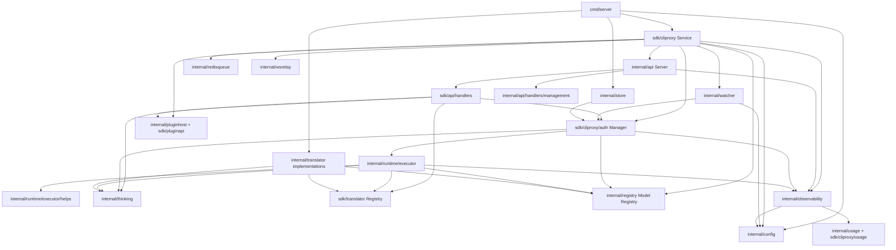
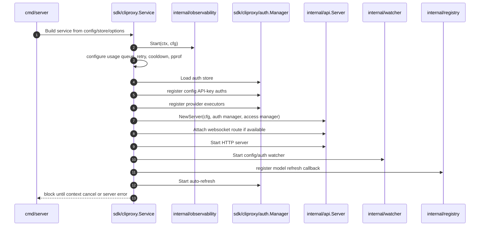
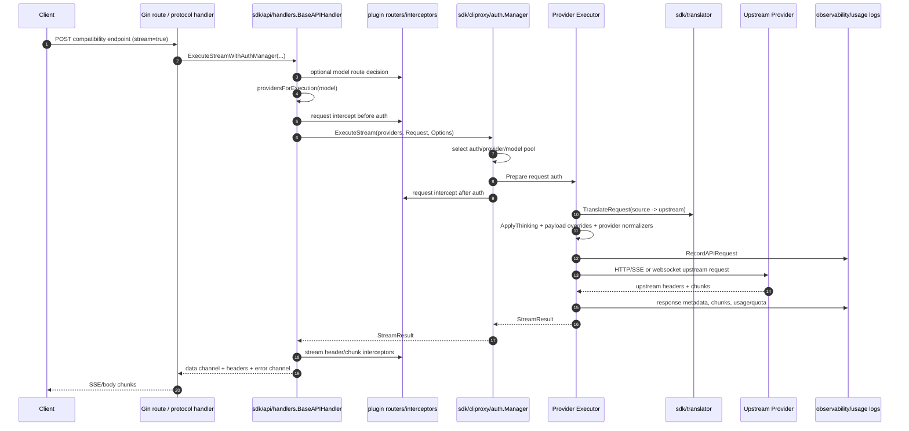

# CLIProxyAPI Architecture

CLIProxyAPI is a Go proxy server that presents OpenAI-, Gemini-, Claude-, Codex-, and related compatibility APIs while routing requests to multiple upstream providers, auth credentials, and protocol translators. It combines three concerns in one runtime:

1. **API surface compatibility**: HTTP routes accept provider-shaped requests and return client-shaped responses.
2. **Provider execution**: provider executors translate, normalize, authenticate, send upstream requests, and stream or return responses.
3. **Operational control plane**: config hot reload, auth storage, model registry updates, plugins, usage accounting, and OpenTelemetry/SigNoz-oriented observability.

This document is grounded in the current repository layout and code paths, especially:

- `cmd/server/` — CLI entrypoint and wiring.
- `sdk/cliproxy/service.go` — SDK/runtime service lifecycle and config/auth/plugin registration.
- `internal/api/server.go` and `sdk/api/handlers/handlers.go` — HTTP routing and request execution orchestration.
- `sdk/cliproxy/auth/conductor.go` — credential/provider selection, retries, cooldowns, and execution handoff.
- `internal/runtime/executor/` — upstream provider executors.
- `internal/translator/` and `sdk/translator/` — protocol translation registry and implementations.
- `internal/thinking/` — canonical thinking/reasoning configuration pipeline.
- `internal/config/config.go`, `internal/store/`, `internal/watcher/` — configuration, persisted auth material, and hot reload.
- `internal/observability/` — OpenTelemetry, request/response logging, usage/quota metrics.
- `Dockerfile`, `Dockerfile.debug`, `docker/`, `docs/`, `AGENTS.md` — deploy and fork governance.

## Architectural principles

### 1. Compatibility at the edge; provider semantics inside executors

API handlers normalize requests into a small execution request shape (`sdk/cliproxy/executor`) and pass protocol intent through `Options.SourceFormat` / `Options.ResponseFormat`. Provider-specific details are pushed into executors such as `internal/runtime/executor/claude_executor.go`, `openai_compat_executor.go`, `codex_executor.go`, and `gemini_executor.go`.

### 2. Registry-driven routing, not hardcoded endpoint fanout

Model-to-provider resolution is handled through registries and auth manager selection rather than routes directly choosing credentials. The request path is:

`handler model name` → `model router/plugin decision` → `registry provider list` → `auth manager selector` → `executor`.

The relevant anchors are `providersForExecution` and `applyModelRouter` in `sdk/api/handlers/handlers.go`, plus `Execute`, `ExecuteStream`, and mixed execution loops in `sdk/cliproxy/auth/conductor.go`.

### 3. Canonical thinking representation before provider translation

`internal/thinking/` centralizes suffix parsing, request-body extraction, validation, and provider application. The intended shape is:

`model suffix / body config` → `ThinkingConfig` → provider-specific `ProviderApplier`.

Executors call `thinking.ApplyThinking` after request translation and before payload override/normalization.

### 4. Fork-specific compatibility fixes live near executor helpers

Fork behavior is concentrated in `internal/runtime/executor/helps/`, executor files, config, and tests. Examples include Cursor prompt rewrites, GLM normalization, openai-compatible stream normalization, Codex continue-thinking, xAI/Grok request sanitization, and Claude cache control.

### 5. The SDK service is the composition root

`cmd/server` is the CLI bootstrap, but `sdk/cliproxy/service.go` is the main runtime composition root: it starts usage, observability, auth loading, config/auth watchers, plugins, model registration, websocket gateway, HTTP server, and shutdown.

## Module dependency graph

### Layering intent

| Layer | Representative paths | Responsibility |
| --- | --- | --- |
| Entry/runtime | `cmd/server/`, `sdk/cliproxy/service.go` | Parse config/env, construct service, register executors/models/plugins, start/stop runtime. |
| HTTP edge | `internal/api/server.go`, `sdk/api/handlers/`, `sdk/api/handlers/{openai,claude,gemini}` | Define compatibility routes, parse request shape, stream/write downstream responses. |
| Execution conductor | `sdk/cliproxy/auth/conductor.go` | Select auth/provider, apply aliases/model pools, retry/cooldown, mark results, call executors. |
| Provider executors | `internal/runtime/executor/` | Translate request, apply thinking/payload overrides, inject credentials, call upstream APIs, translate responses. |
| Provider helpers | `internal/runtime/executor/helps/` | Cache anchors, prompt rewrites, provider normalizers, logging, quota parsing, proxy/transport helpers. |
| Translation | `sdk/translator/`, `internal/translator/` | Register protocol conversion functions and execute request/response conversion. |
| Model/thinking | `internal/registry/`, `internal/thinking/` | Model capabilities, remote/local model catalog, unified reasoning config. |
| Control plane | `internal/config/`, `internal/store/`, `internal/watcher/`, `internal/managementasset/` | Config structs, persistence backends, hot reload, management snapshots/assets. |
| Observability/usage | `internal/observability/`, `internal/usage/`, `sdk/cliproxy/usage`, `internal/redisqueue/` | OTel traces/logs/metrics, quota/usage publication, request/response logs, durable queues. |
| Extensions | `internal/pluginhost/`, `sdk/pluginapi/` | Plugin models, executors, routers, interceptors, auth parsers, thinking providers. |

## Top-level module map

### `cmd/server/`

The server entrypoint loads environment/config, initializes management assets, model registries/translators, stores, auth managers, and the SDK service. It is intentionally thin compared to `sdk/cliproxy/service.go`, but still owns CLI concerns and startup flags.

Key dependencies observed from imports: `internal/config`, `internal/store`, `internal/registry`, `internal/translator`, `internal/tui`, `internal/home`, `internal/pluginhost`, `sdk/cliproxy`, and `sdk/cliproxy/auth`.

### `sdk/cliproxy/`

The public embeddable service layer. `Service.Run` in `sdk/cliproxy/service.go` starts:

- usage accounting (`usage.StartDefault`),
- observability (`observability.Start`),
- Redis usage queue configuration,
- auth directory setup and auth store loading,
- config API-key auth synthesis,
- executor registration,
- websocket gateway,
- HTTP API server,
- config/auth watchers,
- model refresh callbacks,
- core auth auto-refresh.

It also handles hot reload through `applyConfigUpdateWithAuthSynthesis`, which updates routing selectors, retry config, cooldown store, pprof, observability, server clients, core auth config, plugin runtime config, config-synthesized auths, and plugin model runtime.

### `internal/api/` and `sdk/api/handlers/`

`internal/api/server.go` builds the Gin server and attaches API modules, middleware, management handlers, websocket routes, and model/provider-specific handlers.

`sdk/api/handlers/handlers.go` is the main execution adapter. For streaming requests, `executeStreamWithAuthManagerFormats`:

1. applies model router plugins,
2. resolves providers and normalized model,
3. prepares execution metadata,
4. builds `coreexecutor.Request` and `Options`,
5. applies request interceptors before auth,
6. calls `AuthManager.ExecuteStream`,
7. initializes downstream headers,
8. optionally retries bootstrap stream failures before any payload bytes are sent,
9. applies stream interceptors,
10. validates OpenAI Responses SSE chunks when needed,
11. forwards bytes/errors to the HTTP route layer.

Non-streaming execution follows the same broad structure with response interceptors rather than stream chunk interceptors.

### `sdk/cliproxy/auth/`

The auth manager is the provider/credential conductor. It owns:

- registered provider executors (`RegisterExecutor`),
- auth store loading and updates,
- model alias and model pool handling,
- provider selection strategies such as round-robin/fill-first/session affinity,
- cooldown state and result marking,
- credential preparation and refresh,
- mixed provider execution loops.

`Execute`, `ExecuteCount`, and `ExecuteStream` normalize provider lists, wrap retries with cooldown waits, and delegate to `executeMixedOnce`, `executeCountMixedOnce`, or `executeStreamMixedOnce`.

### `internal/runtime/executor/`

Executors are stateless provider clients keyed by provider. Common executor responsibilities:

- resolve credentials and base URL from `*cliproxyauth.Auth`,
- translate the incoming protocol into upstream protocol with `sdktranslator.TranslateRequest`,
- apply thinking config via `thinking.ApplyThinking`,
- apply config payload overrides with helper functions,
- perform provider-specific normalization/sanitization,
- record upstream request/response logs and usage/quota metrics,
- execute HTTP or websocket calls,
- translate responses back to the requested downstream format.

Important examples:

- `openai_compat_executor.go`: OpenAI-compatible HTTP execution, images endpoints, GLM normalization, Alibaba explicit cache control, Kimi reasoning normalization, openai-compatible stream normalization.
- `claude_executor.go`: Claude Messages API execution, Cursor prompt handling, Claude OAuth tool renaming, Claude cache control and diagnostics, signature sanitization, web-search-domain sanitization.
- `codex_executor.go` and `codex_websockets_executor.go`: Codex responses/websocket execution, continuation fold, liveness deadlines.
- `xai_executor.go`: xAI/Grok request sanitization and tool handling.
- `antigravity_executor.go`, `gemini_executor.go`, `gemini_vertex_executor.go`, `aistudio_executor.go`, `kimi_executor.go`: other upstream provider families.

### `internal/runtime/executor/helps/`

This is the provider compatibility toolbox. It contains focused helpers and tests for:

- prompt/cache control (`claude_cache_control.go`, `claude_cursor_system_prompt.go`, `cursor_system_prompt.go`),
- Claude cache diagnostics (`claude_cache_diagnostics.go`),
- GLM request normalization (`glm_normalizer.go`),
- OpenAI-compatible stream normalization (`openai_compat_stream_normalizer.go`),
- Codex continue-thinking helpers (`codex_continue_thinking.go`),
- Kimi reasoning cleanup (`kimi_reasoning_normalizer.go`),
- request/response logging and usage parsing (`logging_helpers.go`, `usage_helpers.go`),
- proxy and uTLS clients (`proxy_helpers.go`, `utls_client.go`),
- session/user caches and provider payload helpers.

### `internal/translator/` and `sdk/translator/`

`sdk/translator` is the registry and generic interface for request/response translation. `internal/translator/translator/translator.go` bridges internal translator registrations into that SDK registry.

Each protocol pair registers itself from an `init.go` file, for example:

- `internal/translator/claude/openai/chat-completions/init.go`,
- `internal/translator/openai/claude/init.go`,
- `internal/translator/gemini/openai/responses/init.go`,
- `internal/translator/codex/claude/init.go`,
- `internal/translator/antigravity/...`.

The root `internal/translator` package imports all implementations for side-effect registration. This is why entrypoints must import `internal/translator` before translation is used.

### `internal/thinking/`

The thinking pipeline is designed as a deep module. Callers provide body, model, source format, target format, and provider key; `ApplyThinking` handles:

1. provider applier lookup,
2. model suffix parsing,
3. registry capability lookup,
4. request-body config extraction,
5. validation and normalization,
6. provider-specific application.

It intentionally treats unknown/user-defined models as pass-through-with-application where possible, letting the upstream validate provider-specific details.

### `internal/registry/`

The registry tracks model metadata, provider associations, model aliases, remote updates, and local model behavior. `--local-model` disables remote updates in production-style deployments according to the repository rules.

### `internal/config/`

`internal/config/config.go` is a large central schema for server config, provider config, routing, observability, auth, payload overrides, Home mode, cache settings, and fork-specific flags. Config is loaded from `config.yaml` by default, with templates in `config.example.yaml` and Docker-specific config under `docker/`.

### `internal/store/`

Storage abstracts persisted auth/config material. The repository supports file-based default storage plus optional Postgres, git, and object-store backends. The auth manager consumes this through `sdk/cliproxy/auth` types.

### `internal/watcher/`

Watches config and auth directories, synthesizes config-derived API-key auths, diffs changes, and triggers service config reload. The service-level hot reload path is `applyWatcherConfigUpdate` → `applyConfigUpdateWithAuthSynthesis`.

### `internal/observability/`

OpenTelemetry integration and fork-specific metrics live here. Observability starts in `Service.Run`, restarts on config reload in `applyObservabilityConfig`, and is used by handlers/executors/auth manager for request metadata, quota, usage, and transport logs.

### `internal/wsrelay/`

Hosts websocket relay sessions and integrates with the HTTP server and AI Studio/Codex-style websocket execution. The service attaches the websocket route through `s.server.AttachWebsocketRoute` when a gateway is available.

## Core runtime lifecycle

Shutdown reverses this in `Service.Shutdown`: Home subscriber/log forwarding, watcher, auth auto-refresh, websocket gateway, auth queue, pprof, server, usage queue, observability, and related background workers are stopped idempotently.

## Request execution flow

### Streaming request path

### Non-streaming request path

Non-streaming requests use the same route → handler → auth manager → executor chain, but executors read the full upstream body, publish usage, translate the full response with `sdktranslator.TranslateNonStream`, and handlers apply response interceptors before returning a single payload.

## Provider/executor/translator pipeline

### Request translation and provider normalization

The canonical executor sequence is visible in `internal/runtime/executor/openai_compat_executor.go`:

1. Parse base model with `thinking.ParseSuffix(req.Model).ModelName`.
2. Determine `from := opts.SourceFormat` and `to := sdktranslator.FromString("openai")` or another upstream format.
3. Translate original and current payloads with `sdktranslator.TranslateRequest`.
4. Apply reasoning config through `thinking.ApplyThinking`.
5. Apply configured payload overrides through helper functions.
6. Run provider-specific normalizers such as `NormalizeGLMRequestBody` or explicit cache injection.
7. Send upstream request with auth headers and proxy-aware transport.
8. Record metadata, logs, chunks, usage, and quota.
9. Translate upstream response to `opts.ResponseFormat` or source format.

Claude follows the same high-level pattern in `prepareMessagesRequest` in `internal/runtime/executor/claude_executor.go`, but targets Anthropic Messages format and applies Claude-specific prompt/tool/cache/signature handling.

### Translator registration model

Translators are registered by side-effect imports. Each `init.go` calls `translator.Register(from, to, requestFunc, responseFunc)`, which delegates to `sdk/translator`.

This makes adding a new protocol pair mechanically simple, but increases the importance of entrypoint imports and test coverage. If an entrypoint forgets to import `internal/translator`, the registry exists but is empty.

### Thinking provider model

Provider appliers are registered under provider names (`claude`, `gemini`, `openai`, `codex`, `antigravity`, `kimi`, `xai`) and can also be plugin-owned. This allows built-in providers and plugins to share the same suffix/body validation semantics without pushing suffix parsing into every executor.

## Config, auth, storage, and routing model

### Config model

Primary configuration is loaded from `config.yaml`, with examples in `config.example.yaml` and Docker config under `docker/`. Important architectural sections include:

- server host/port/TLS,
- provider config and `openai-compatibility` providers,
- model aliases and OAuth model aliases,
- payload overrides,
- routing strategy and session affinity,
- auth directory and storage backend,
- Redis usage queue,
- observability/transport logs,
- Home mode,
- fork-specific behavior such as Claude cache scope and Codex continue-thinking.

The large `internal/config/config.go` schema is convenient for centralized loading but is also a coupling hotspot.

### Auth model

Auth material is represented by `sdk/cliproxy/auth.Auth` and loaded by the core auth manager. Auths can be:

- OAuth-derived provider credentials,
- config-synthesized API-key auths,
- OpenAI-compatible provider records,
- plugin-provided auth/model records,
- Home-mode-provided remote auth context.

The service registers executors based on auth provider through `registerExecutorForAuth` in `sdk/cliproxy/service.go`. Known native mappings include Claude, Gemini/Vertex/AI Studio, Antigravity, Codex, Kimi, xAI/Grok, and OpenAI-compatible providers.

### Storage model

`internal/store/` supports multiple persistence backends. File storage is the default; optional Postgres, git, and object-store modes are configured via environment/config. Storage is intentionally below the auth manager: the conductor should not know whether auths came from files, Postgres, git, or object storage.

### Routing model

Routing has three nested levels:

1. **Model router plugins** can force a plugin executor or provider/model target.
2. **Model registry** maps model names to one or more provider keys.
3. **Auth manager selector** chooses a concrete auth credential for the provider/model, applying round-robin, fill-first, session affinity, cooldown, and retry behavior.

## Observability and deploy notes

### Observability

`internal/observability/` provides the OTel backbone and fork-specific operational metrics. It is started in `Service.Run`, restarted on config reload, and used by handlers/executors/auth manager to record:

- HTTP/API metadata,
- request/response transport logs where enabled,
- quota utilization and burned quota,
- usage/token metrics,
- config reload success/duration,
- upstream errors and response statuses.

Request/response logs are especially important for Cursor prompt-shape diagnosis: raw downstream payloads appear under `=== REQUEST BODY ===`, while final upstream payloads appear under `=== API REQUEST ===`.

### Deployment

The production-oriented build is governed by `Dockerfile` and repo rules in `AGENTS.md`:

- Go 1.26+ build.
- CGO-enabled build with `zig cc` because plugin support needs Go `plugin` and glibc-compatible runtime loading.
- Runtime image is distroless Debian 12 nonroot for production.
- `Dockerfile.debug` preserves a shell/curl runtime for debugging builds only.
- Production target is ARM (`linux/arm64`) and uses `ghcr.io/harshav167/cliproxyapi:prod-arm64`.
- In-container curl healthcheck is intentionally absent in distroless; rely on sidecar/external `GET /healthz`.

## Fork-specific invariants to preserve

These are architecture constraints, not incidental features. They are documented in `AGENTS.md` and represented in code/tests.

### Cursor prompt and Claude path invariants

- `internal/runtime/executor/helps/cursor_system_prompt.go`
- `internal/runtime/executor/helps/claude_cursor_system_prompt.go`
- related tests in `internal/runtime/executor/helps/*cursor*test.go`

Cursor prompt rewrite and Claude system-block rebuild are fork behavior and must not be lost during upstream sync.

### xAI/Grok composer fixes

- `internal/runtime/executor/xai_executor.go`
- `internal/runtime/executor/xai_executor_test.go`

The request sanitizers and `apply_patch` handling prevent upstream xAI schema failures and should survive merges.

### GLM/Z.AI normalization

- `internal/runtime/executor/helps/glm_normalizer.go`
- `internal/runtime/executor/helps/glm_normalizer_test.go`
- call sites in `internal/runtime/executor/openai_compat_executor.go`

GLM effort/thinking coupling, field stripping, tool-stream enabling, and stable tool sorting support Cursor behavior and prompt-cache economics.

### OpenAI-compatible stream normalizer

- `internal/runtime/executor/helps/openai_compat_stream_normalizer.go`
- streaming call sites in `internal/runtime/executor/openai_compat_executor.go`

This preserves Cursor rendering when providers emit explicit empty string deltas.

### Codex continue-thinking fold

- `internal/runtime/executor/codex_continue_fold.go`
- `internal/runtime/executor/helps/codex_continue_thinking.go`
- `internal/runtime/executor/codex_executor.go`

This is a default-off multi-round continuation feature for Codex reasoning truncation.

### Observability fork depth

- `internal/observability/`
- executor quota recording calls
- `docs/signoz-observability.md`

Quota metrics, error-body transport logs, and usage reporting are deeper than upstream and should remain intact.

### Billing/cache behavior

- `internal/config/config.go` (`ClaudeCursorGlobalCacheScope`)
- `internal/runtime/executor/helps/claude_cache_control.go`

Claude cache anchoring and global scope behavior are billing-sensitive and should be treated as architectural contracts.

## Known architecture risks

### Risk 1: Service and auth conductor are very large composition hotspots

`service.go` is approximately 2.8k lines and `conductor.go` is approximately 5.8k lines. They both coordinate many concerns: runtime lifecycle, config reload, plugins, auth, model registration, routing, retries, cooldowns, Home mode, observability, and websocket behavior.

**Consequence:** changes in these files have high accidental blast radius and are hard to review locally.

**Suggested direction:** extract deep submodules around stable seams, not generic helpers:

- service lifecycle phases (`observability`, `auth loading`, `watchers`, `plugins`, `websocket`) as named orchestration objects,
- auth selection/retry policy separate from execution loops,
- model registration/synthesis separate from auth manager mutation.

### Risk 2: Translation registry relies on side-effect imports

The translator graph is initialized by `init()` registrations. This is simple but implicit.

**Consequence:** a new entrypoint or test can accidentally omit `internal/translator` and get missing translation behavior only at runtime.

**Suggested direction:** add an explicit translator bootstrap/assertion API for entrypoints and tests, while preserving existing side-effect registration for compatibility.

### Risk 3: `internal/config/config.go` is a central coupling magnet

The config struct spans server, routing, observability, provider details, Home mode, Redis, payload overrides, cache flags, and fork features.

**Consequence:** unrelated changes collide in one schema file, and feature ownership is hard to see.

**Suggested direction:** split schema sections into files within `internal/config/` without changing the public YAML shape. Keep one top-level `Config` but move nested structs and validation/defaulting by domain.

### Risk 4: Executor helpers are numerous and heterogeneous

`internal/runtime/executor/helps/` contains provider normalizers, logging, prompt rewrites, cache logic, proxy clients, usage parsing, and compatibility patches.

**Consequence:** the directory is correct as a dependency direction, but weakly organized internally; discoverability depends on filenames and tribal knowledge.

**Suggested direction:** create subpackages only where cohesion is strong and import cycles remain absent, for example `helps/logging`, `helps/cachecontrol`, or `helps/cursor`. Do not split just to reduce file count.

### Risk 5: Plugin seams increase request-flow complexity

Plugins can route models, provide executors, intercept requests/responses/stream chunks, provide auth/model metadata, and register thinking appliers.

**Consequence:** debugging one request requires knowing which plugin seam fired and whether it ran before auth, after auth, or during streaming.

**Suggested direction:** improve per-request structured trace events for plugin decisions: router result, interceptor mutations, skipped plugin IDs, and plugin executor selection.

### Risk 6: Provider-specific compatibility patches can be bypassed by new paths

Fork features often depend on exact placement in executor flows: after translation, before payload override, before cloaking, before stream response forwarding, etc.

**Consequence:** adding a new executor path, websocket fallback, or compact endpoint can accidentally bypass normalization/cache/prompt behavior.

**Suggested direction:** document executor phase order as a small contract and add table-driven tests for each provider path asserting required phase effects.

### Risk 7: Observability is operationally critical but partly optional at runtime

`Service.Run` logs and disables observability on startup failure. This is operationally graceful but can hide missing telemetry unless deployment checks catch it.

**Consequence:** production behavior analysis falls back to logs when SigNoz/OTel is down; regressions may be noticed late.

**Suggested direction:** add explicit startup/runtime health reporting for observability state, exporter failures, and transport log status.

## Prioritized improvement roadmap

### P0 — Preserve fork invariants during upstream syncs

- Keep `AGENTS.md`, `MIGRATION-LEDGER.md`, `.agents/skills/upstream-sync/SKILL.md`, and `docs/upstream-sync.md` as mandatory sync references.
- Before resolving merge conflicts, enumerate fork-only files and verify they remain present after merge.
- Add lightweight smoke tests around Cursor/Claude, GLM, xAI, Codex continue-thinking, and stream normalization paths.

### P1 — Make request phase order explicit

Create a short developer-facing contract for executor order:

1. source request received,
2. model route decision,
3. request intercept before auth,
4. auth/provider/model selection,
5. request intercept after auth,
6. protocol translation,
7. thinking application,
8. payload override,
9. provider normalization/cache/prompt handling,
10. upstream send,
11. response usage/quota/logging,
12. response translation,
13. response/stream interception,
14. downstream return.

Then add tests that assert phase-sensitive fork behavior lands in the intended phase.

### P2 — Reduce `conductor.go` risk by extracting policy seams

Keep public behavior stable, but isolate:

- retry/cooldown decision policy,
- selector/model-pool preparation,
- result marking/error classification,
- stream bootstrap/fallback handling.

The goal is not fewer lines alone; it is making auth selection and execution retry rules independently testable.

### P3 — Split config schema by domain inside `internal/config/`

Keep YAML/API compatibility, but move nested structs/defaulting into domain files:

- `routing.go`,
- `observability.go`,
- `providers.go`,
- `storage.go`,
- `home.go`,
- `payload_overrides.go`,
- `fork_flags.go`.

This reduces merge conflicts and helps contributors find the right config owner.

### P4 — Add explicit translator bootstrap validation

Introduce a small assertion used by startup/tests:

- known critical pairs are registered,
- response formats used by handlers have translators,
- missing registrations fail early with actionable messages.

This preserves current registration mechanics while making failures deterministic.

### P5 — Improve plugin observability

For each request, emit structured debug/trace fields for:

- model router plugin chosen/skipped,
- target kind/provider/model/executor plugin,
- request interceptor body/header mutation presence,
- response/stream interceptor mutation/drop,
- skip plugin ID.

Avoid logging bodies or secrets; record mutation metadata and plugin identity.

### P6 — Organize executor helpers by cohesive domains

Only after phase tests exist, consider subpackages or README-level indexing for `internal/runtime/executor/helps/`. Candidate groupings:

- Cursor/Claude prompt behavior,
- cache and billing controls,
- provider normalizers,
- usage/quota/logging,
- transports/proxy/uTLS,
- stream normalization.

### P7 — Strengthen deploy and telemetry gates

Add automated checks around:

- ARM distroless build viability,
- plugin support with CGO enabled,
- `/healthz` external probe,
- observability startup state,
- request/response logs path availability in prod-like deployments.

## Change guidance for future contributors

- Prefer adding provider-specific normalization in executors or `internal/runtime/executor/helps/`, not in translators, unless the change is truly protocol conversion.
- Treat `internal/translator/` as a conversion layer, not a provider policy layer.
- Do not bypass `thinking.ApplyThinking`; extend provider appliers or registry capabilities instead.
- When adding a provider, wire all four areas deliberately: model registry/config, auth synthesis/registration, executor, translator pair(s).
- When adding a request path, check whether plugin router/interceptor, request logging, usage reporting, quota parsing, thinking suffixes, aliases, and stream normalization apply.
- When changing production behavior, update `AGENTS.md` and `MIGRATION-LEDGER.md` if the invariant matters across upstream syncs.
